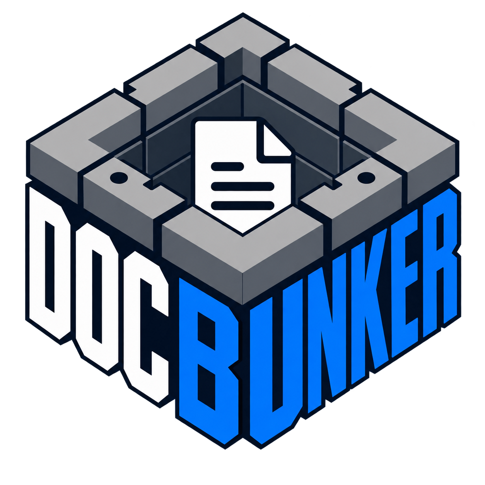

<div align="center">



# DocBunker

**Open untrusted documents in a sandbox. Only pixels reach your machine.**

[](https://github.com/industrialsoftwarexyz/DocBunker/actions/workflows/ci.yml)
[](LICENSE)
[](https://github.com/industrialsoftwarexyz/DocBunker/releases)

[Download](https://github.com/industrialsoftwarexyz/DocBunker/releases/latest) · [Docs](https://industrialsoftwarexyz.github.io/DocBunker/) · [Build from source](#build-from-source)

</div>

---

## What is it?

DocBunker opens PDFs, images and Office files inside a disposable sandbox
(gVisor on Linux, QEMU+gVisor on Windows/macOS). The parser runs in an
isolated box with no network and no access to your files. Only the rendered
pixels come back. When you close it, the sandbox is destroyed.

## Supported files

| Format | Result |
| --- | --- |
| PDF | Rendered pages |
| PNG, JPEG, WebP | Rendered image |
| DOCX, PPTX, XLSX | Text preview |

No copy-paste or search yet — pixels only, on purpose.

## Download

Get the latest from [**GitHub Releases**](https://github.com/industrialsoftwarexyz/DocBunker/releases/latest).

| Platform | Requires |
| --- | --- |
| Windows 10/11 x64 | [QEMU](https://qemu.org) |
| macOS (Apple Silicon) | `brew install qemu` |
| Linux x64 / aarch64 | QEMU from your package manager |

**0.1.0** — early days, expect rough edges.

## Build from source

Rust 1.85+, Node.js 20+, [Tauri 2 prerequisites](https://v2.tauri.app/start/prerequisites/).

```bash
npm --prefix frontend ci && npm --prefix frontend run build
cargo test --workspace

npm --prefix frontend run dev                    # terminal 1
cargo run --manifest-path src-tauri/Cargo.toml   # terminal 2
```

Debug builds use a fake backend — no QEMU or gVisor needed. Set
`DOCBUNKER_BACKEND` to `mock`, `subprocess`, `runsc` or `vm`.

## Docs

[How it works](https://industrialsoftwarexyz.github.io/DocBunker/overview/) ·
[Architecture](https://industrialsoftwarexyz.github.io/DocBunker/architecture/) ·
[Sandbox](https://industrialsoftwarexyz.github.io/DocBunker/sandbox/) ·
[Threat model](https://industrialsoftwarexyz.github.io/DocBunker/threat-model/) ·
[Roadmap](https://industrialsoftwarexyz.github.io/DocBunker/roadmap/)

Contributing: [CONTRIBUTING.md](CONTRIBUTING.md). Security issues: [SECURITY.md](SECURITY.md).

## License

MIT. The optional MuPDF feature links AGPL code and stays out of default builds.
