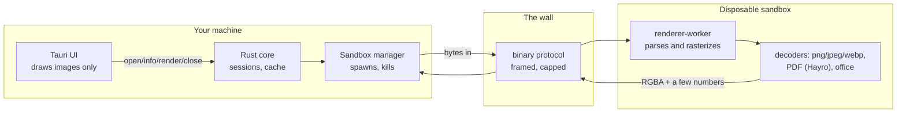
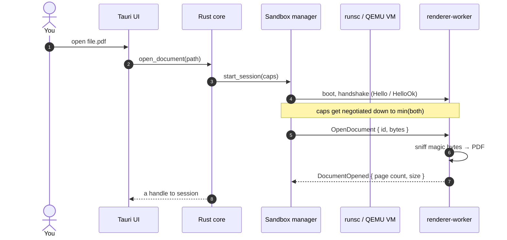
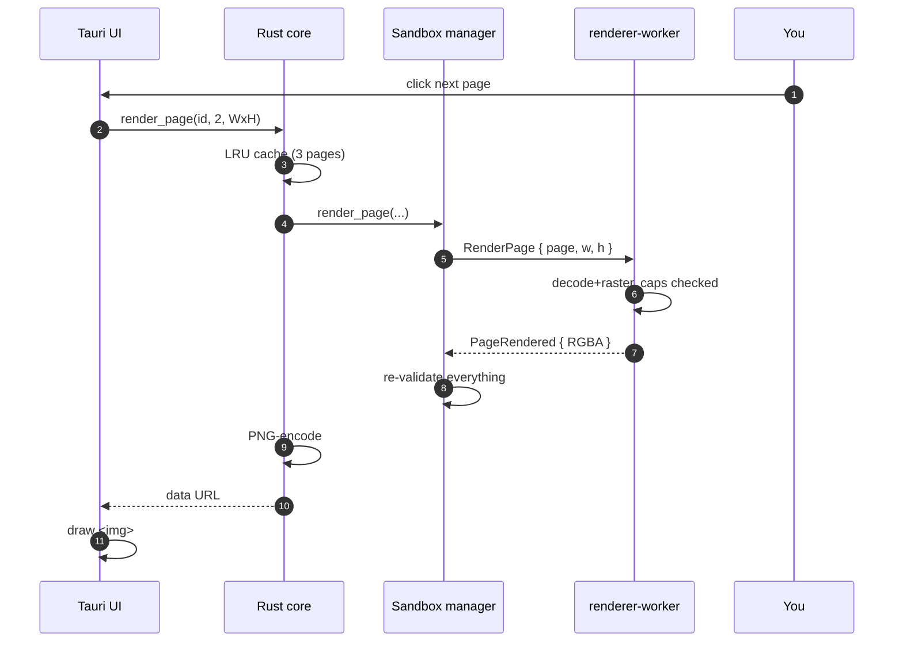
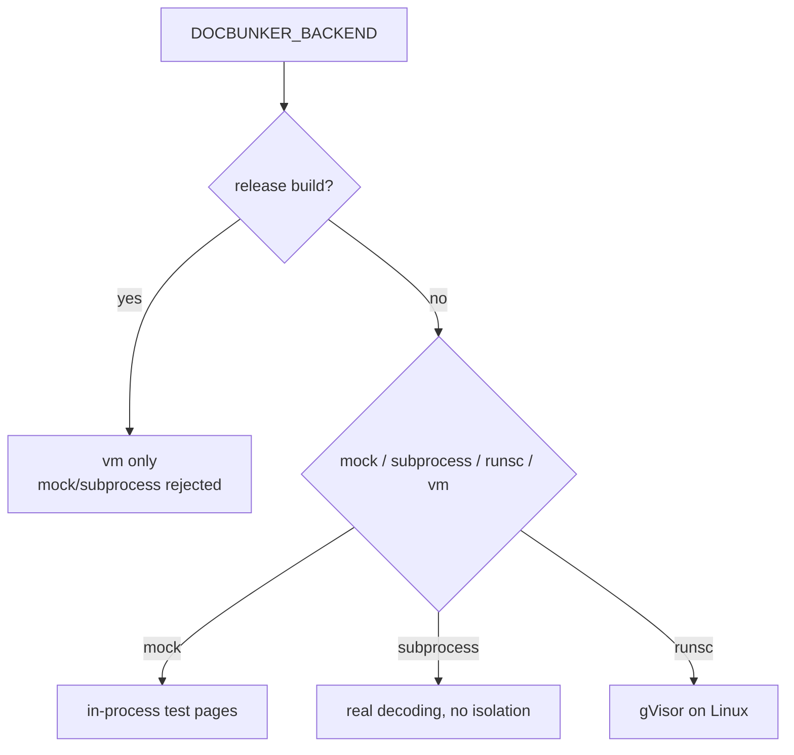
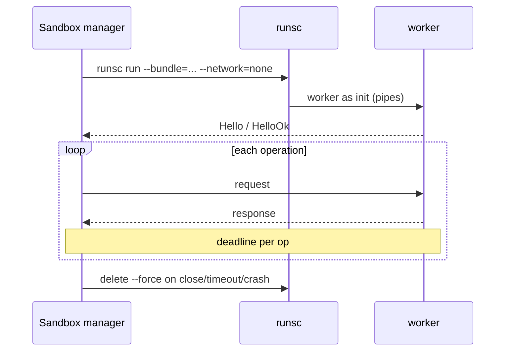
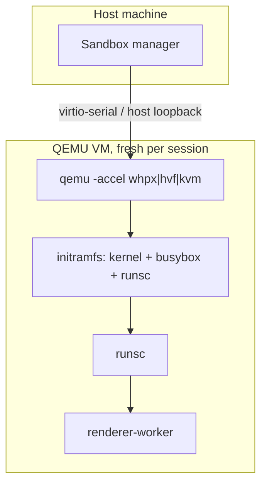

# How DocBunker works

This document follows a document from the moment you drop it in the window to
the moment you see a page. If you want the spec-level details, [architecture](architecture.md),
[sandbox](sandbox.md) and [protocol](protocol.md) have them; here we mostly
describe what actually happens when you use the app.

## The shape of the system

DocBunker runs (almost) nothing on your machine. There is a small trusted
side — the Tauri UI, a Rust core, the sandbox manager — and one thing on the
other side of a wall: a `renderer-worker` subprocess that does all the
parsing. The wall is the binary IPC protocol. The worker lives inside gVisor
on Linux; on Windows and macOS it lives in a QEMU VM with gVisor inside.



Why this shape: parsing is where attackers live, so the parser gets no
access to the host. It reads document bytes, writes pixels back, and gets
deleted.

## Opening a document, step by step



Each side decides caps independently: the host advertises what it accepts,
the worker replies with what it can do, and afterwards every message is
checked against the smaller of the two. If a worker tries to negotiate more
than the host allows (or vice versa), the session dies.

Actually, look at `crates/protocol/src/message.rs` and `crates/sandbox` —
all of this is plain Rust you can read.

## Rendering a page



Caveats worth knowing: the cache only holds three pages (previous, current,
next), and a copy is made on read — shared memory exists for the dev
`subprocess` backend, but the sandboxes still transfer frames bytewise, which
is fine for the sizes in play. And the worker never sends back HTML, links,
fonts, SVG — anything that could be interpreted. Just pixels and numbers.

## Which sandbox do you get?

There is no single "sandbox". The app picks one of four backends; the
selection depends on build type, `DOCBUNKER_BACKEND` and the platform.

| Backend | Parses real docs? | Isolated? | Typical use |
| --- | --- | --- | --- |
| `mock` | no (test pages) | no | debug default |
| `subprocess` | yes | no | local dev, opt-in feature |
| `runsc` | yes | gVisor | Linux production |
| `vm` | yes | QEMU → gVisor | Windows/macOS/Linux production |



A release build simply refuses `mock` and `subprocess`; it never falls back
to an unisolated backend, not even "temporarily". To use those locally in a
release build you have to opt into the `development-backends` cargo feature
(it exists for developer machines only).

## Inside the runsc sandbox

On Linux the sandbox manager drives `runsc` itself — no Docker, no Podman.
Each session gets a fresh OCI bundle, written by `OciBundle` in
`crates/sandbox/src/runsc_bundle.rs`, and the worker is the container init,
speaking the protocol over pipes.

Hardening profile (all of this is in the OCI config):

- user: unprivileged uid/gid 65534
- rootfs: read-only, no host mounts, `/tmp` a private tmpfs capped at 256 MiB
- network: empty netns (`--network=none`)
- capabilities: none
- cgroup limits: memory, CPU quota, PID limit
- environment: empty (`env_clear()`)
- document bytes only over IPC — never written as a file
- per-operation wall-clock deadlines; on expiry the session is killed and
  deleted (`runsc delete --force` + bundle destruction)

The rootfs image contains exactly: the static musl `renderer-worker`,
fonts if needed, `/tmp /proc /dev /etc` scaffolding. No shell, no tools, no
network utilities.



## The VM path

On Windows/macOS (and Linux when `vm` is chosen) the wall is a tiny VM:
QEMU with WHPX/HVF/KVM, booting a minimal initramfs that contains `runsc`
and the worker. `gVisor` then runs inside the VM — two boundaries because
an escape from gVisor should still not reach the host kernel.



The guest has no network device. `kernel` and `initramfs.cpio.gz` are hash-
pinned (`SHA256SUMS` in the build scripts); release builds verify the bundled
images before launching QEMU.

## Failure mode, in one idea

When anything looks wrong — a page out of range, a frame over the limit,
junk in the stream, a worker that won't answer in time — the simplest
correct action is to kill the session and start over; a fresh sandbox is
cheaper than trusting a compromised one. So that's what happens. The
specific cases and the error codes are in [protocol.md](protocol.md#error-codes),
and the actual numbers (64 MiB
documents, 4096×4096 pixels, 96 MiB frames) are there too.

## Trying it now

```bash
cargo check --workspace
cargo test --workspace

# dev: real decoding, no isolation
DOCBUNKER_BACKEND=subprocess cargo run -p docbunker-app

# Linux: runsc e2e (requires runsc + a built rootfs)
sh sandbox/scripts/build-rootfs.sh "$PWD/sandbox/rootfs" \
  "$PWD/target/x86_64-unknown-linux-musl/release/renderer-worker"
sudo env DOCBUNKER_RUNSC_BIN=runsc DOCBUNKER_ROOTFS="$PWD/sandbox/rootfs" \
  cargo test -p docbunker-sandbox runsc_end_to_end -- --ignored
```

And the fuzz targets for protocol / format-detection live under
`crates/protocol/fuzz` and `crates/renderer-api/fuzz`.

## Why each piece looks like this

History is in [docs/adr/](adr/index.md); the short version is that each crate exists
because a boundary needed to be explicit (ADR-001–009): Tauri shell, the
raster-only rule, gVisor as Linux isolation, the binary IPC, MuPDF vs Hayro
for PDF, the VM layer, OOXML caps, embedded media, shared-memory transport.
Read them in that order if you want to understand the project's reasoning
instead of its state.